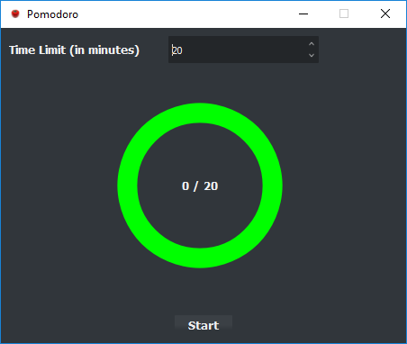
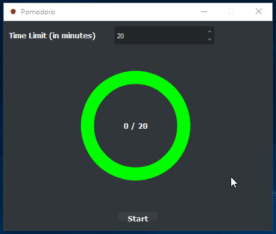

# Pomodoro

A simple Pomodoro timer built using Pyqt5.

### Preview



### Features of the application
1. Set the time limit, with minimum 1 minute and maximum 120 minutes.
2. Shows a notification when the timer completes.

### Installation

1. From Source:
    1.  Install Python 3.5
    2.  See installation instructions on [fbs tutorial](https://github.com/mherrmann/fbs-tutorial)
    3.  After installing required versions: PyQt5==5.9.2, PyInstaller==3.4, fbs==0.4.0, nsis==3.0.1
    4.  Run the script from repo parent directory: 
    ```python -m fbs run```

2. For Windows: Use the Installer or the portable executable found in [dist/windows](https://github.com/Suhas-G/pomodoro-pyqt/tree/master/dist/windows)

3. For other operating systems: TBD

### Demo

